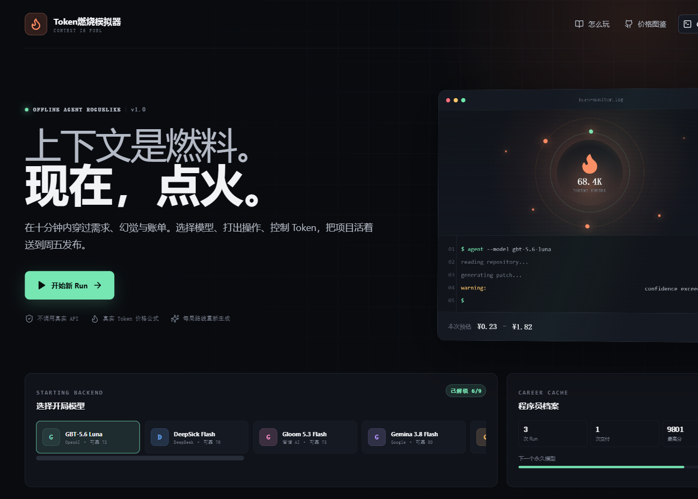

# Token燃烧模拟器

一款在浏览器中运行的轻策略 Agent Roguelike。玩家扮演程序员，在人民币预算、上下文窗口、Deadline 和代码稳定度耗尽前，穿过分支项目、随机事件与上下文休整节点，最终完成“周五 17:59 的发布”。

游戏完全采用预设内容，不调用任何真实大模型 API，不要求 API Key，也不会产生真实费用。Token 用量和费用使用现实模型公开价格的快照进行离线模拟。



## 启动

要求：Node.js 20 或更高版本。

Windows 可直接双击 `start-game.cmd`。第一次启动会自动安装依赖，随后打开浏览器。

也可以在终端运行：

```powershell
cd D:\codex_space\token-run
npm install
npm run play
```

浏览器会打开本地地址。也可以使用 `npm run dev` 启动开发模式，或使用 `npm run build` 生成生产构建。

## 核心玩法

- 一局约 10 分钟，共七层路线；前三个项目三选一，中间出现二选一分支，最终汇聚到发布 Boss。
- 项目通过调查、实现、验证三条进度推进；可以提前交付，但隐藏风险会影响实际结果。
- 操作执行前只显示模糊 Token、费用和风险预测，执行后才显示输入、缓存、输出 Token 及人民币费用。
- Agent 的自信语气不是证据：代码 Diff、测试终端和风险调查才会提高交付把握。
- 每次项目成功后，从新模型或运行时 Buff 中选择一项。
- Run 失败后，可以沿同一随机种子从第一层重试一次；此后重新生成路线。
- 职业 XP、起始模型解锁、图鉴和最高分使用 `localStorage` 保存在浏览器本地。

## 首版内容

- 12 个项目，包括 UI Bug、并发竞态、Unicode、账单精度、安全隔离和最终发布。
- 12 张中等粒度操作卡，覆盖仓库扫描、日志追踪、计划、精准补丁、模块重写、人工热修、测试、回归、自审、上下文压缩、回滚和官方文档检索。
- 6 个随机事件与 3 种上下文休整决策。
- 9 个现实模型价格映射、6 种运行时 Buff。
- Codax Workbench 与 Cloude Code Terminal 两种 Agent 外壳。
- 完整浅色、深色主题。

## 价格口径

价格快照日期为 **2026-09-10**。人民币厂商直接使用人民币公开价格；美元价格按游戏参考汇率 `1 USD ≈ ¥7.15` 换算。

每次操作采用以下公式：

```text
费用 = 未缓存输入 Token × 输入费率
     + 缓存命中 Token × 缓存费率
     + 输出 Token × 输出费率
```

模型费率和官方来源集中维护在 `src/game/data.ts`。游戏内“价格图鉴”也可以直接打开每个厂商的官方来源页。价格会变化，本项目的历史快照不能替代真实账单。

## 验证

```powershell
npm test
npm run build
```

当前自动测试覆盖固定种子路线、Token 与费用结算、上下文压缩、卡牌冷却、模型切换、交付置信度、休整节点、价格数据和职业解锁。

浏览器验收覆盖：

- 主页无横向溢出；模型栏与职业档案不重叠。
- 深色/浅色和 Codax/Cloude 外壳切换并持久化。
- 三个开局项目可选，锁定节点不可点击。
- 操作卡执行后生成准确 Token 账单、代码 Diff 和测试输出。
- 项目奖励、随机事件、上下文休整、最终 Boss 和胜利结算完整可达。
- 结算状态刷新后可从主页“查看上次结算”恢复。

## 说明

Codax、Cloude、DeepSick、Gemina、Gloom、Qwan 与 GBT 均为戏仿名称。本项目与 OpenAI、Anthropic、Google、DeepSeek、智谱 AI、阿里云等现实厂商不存在隶属、赞助或背书关系。

完整设计记录见 [docs/GAME_DESIGN.md](docs/GAME_DESIGN.md)。
